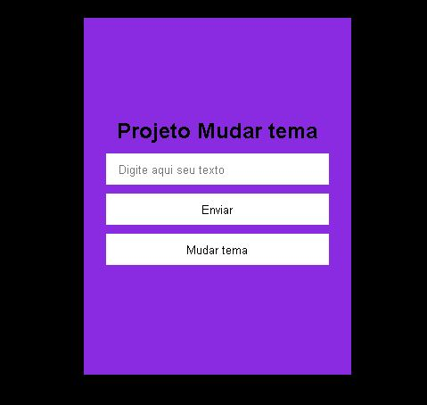
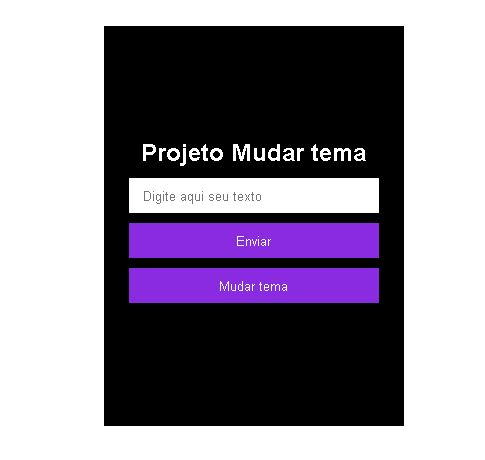

<h1 align="center"> Change theme Js</h1>

 
Estudo sobre mudança de tema com o javascript 

  <a href="#-tecnologias">Tecnologias</a>&nbsp;&nbsp;&nbsp;|&nbsp;&nbsp;&nbsp;
  <a href="#-projeto">Projeto</a>&nbsp;&nbsp;&nbsp;|&nbsp;&nbsp;&nbsp;
  <a href="#-layout">Layout</a>&nbsp;&nbsp;&nbsp;|&nbsp;&nbsp;&nbsp;
  <a href="#memo-licença">Licença</a>

  

 

  
  

## 🚀 Tecnologias

Esse projeto foi desenvolvido com as seguintes tecnologias:

- HTML
- CSS
- JAVASCRIPT
- Ainda não responsivo 

## 💻 Projeto

Estudo feito cobre a troca de mudança de tema ( cores) usando javascript 

- [Visite o projeto] https://github.com/filipeaizen/change-theme-js-estudy

## 🔖 Layout

Sem modelo para cópia 

## :memo: Licença

Esse projeto está sob a licença MIT.

---

Feito com ♥ by Filipe Aizen 